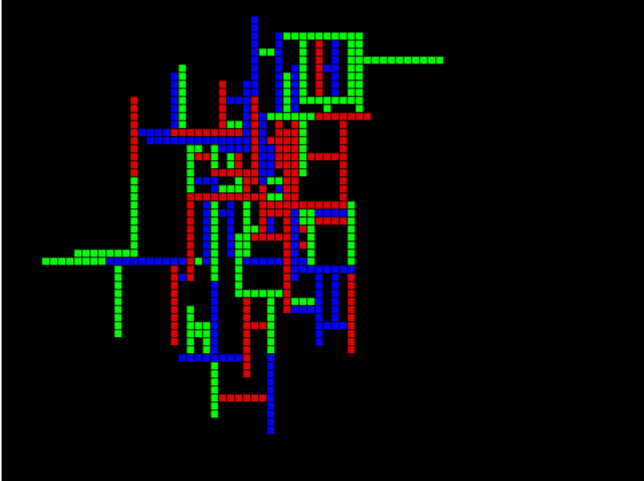

# Procedural Dungeon Generation using Random Walk Algorithm

This is just a proof of concept for a Dungeon generation algorithm in P5.js 
Hopefully with a few tweaks the generation can be ported to unity.

